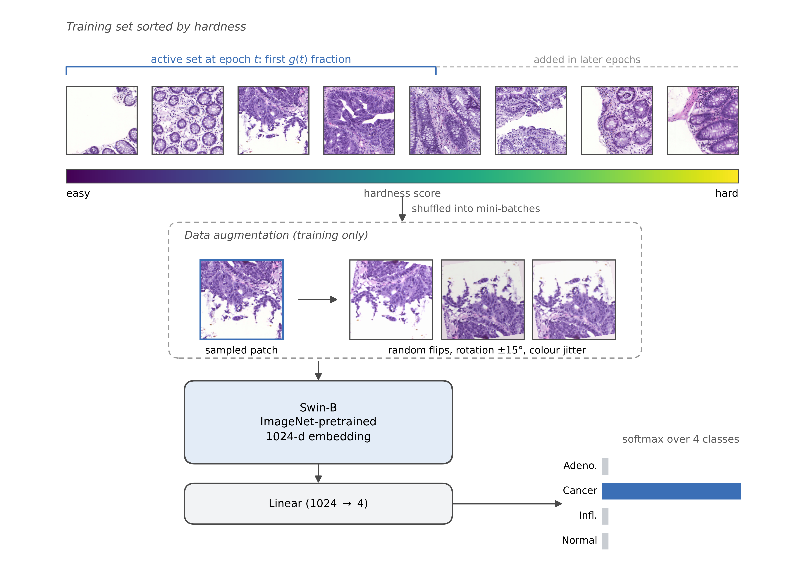

# Comparing-Hardness-Scoring-Strategies-for-Curriculum-Learning-in-Colorectal-Histopathology

Curriculum learning presents training samples in order of difficulty, but its benefit depends on how difficulty is defined, and this choice is rarely examined directly. We compared four hardness scoring strategies, cross-entropy loss, boundary proximity, centroid distance, and a random baseline, together with two ordering directions for classifying colorectal histopathology patches into adenomatous, cancer, inflamed, and normal tissue. Hardness scores were produced by ResNet50 and a Swin Transformer was then trained under an identical linear pacing schedule for every strategy, so that only the ordering differed between experiments. Using 13,874 patches, the full design was repeated at 10%, 25%, 50%, and 100% of the training data. The loss-based easy-to-hard strategy achieved the highest macro F1 at every training set size, reaching 91.56% compared with 90.72% for the random baseline, and boundary proximity ranked second throughout. Centroid distance did not exceed the random baseline, indicating that distance from a class centre measures how atypical a sample is rather than how difficult it is to classify. The gap between easy-to-hard and hard-to-easy ordering narrowed from 3.38 to 0.71 points as training data increased. All strategies ranked the classes identically, with normal classified most accurately (94.90 F1) and adenomatous least accurately (85.50 F1), and the ordering improved the adenomatous and cancer classes by 1.26 and 1.19 points while leaving the largest class almost unchanged at 0.29 points.

